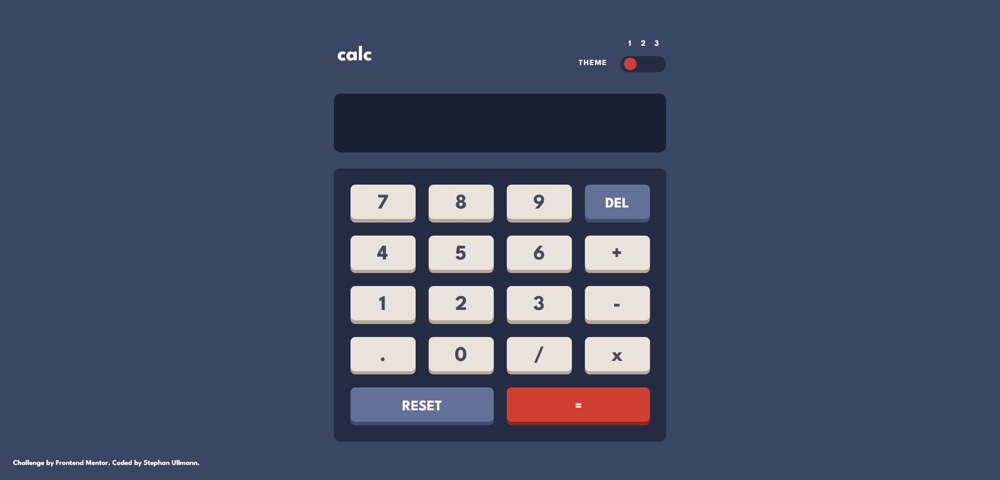
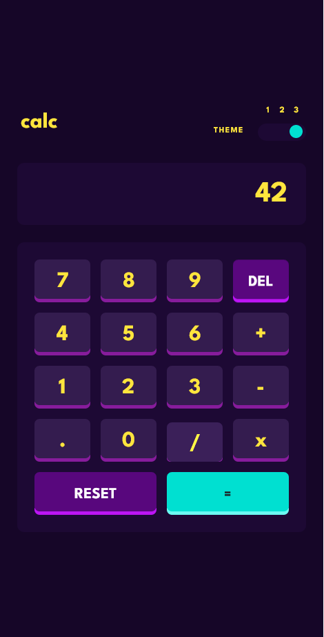

# Frontend Mentor - Calculator app solution

This is a solution to the [Calculator app challenge on Frontend Mentor](https://www.frontendmentor.io/challenges/calculator-app-9lteq5N29). Frontend Mentor challenges help you improve your coding skills by building realistic projects.

## Table of contents

- [Overview](#overview)
  - [The challenge](#the-challenge)
  - [Screenshot](#screenshot)
  - [Links](#links)
- [My process](#my-process)
  - [Built with](#built-with)
  - [What I learned](#what-i-learned)
  - [Continued development](#continued-development)
- [Author](#author)
- [Acknowledgments](#acknowledgments)

## Overview

### The challenge

Users should be able to:

- See the size of the elements adjust based on their device's screen size
- Perform mathmatical operations like addition, subtraction, multiplication, and division
- Adjust the color theme based on their preference
- **Bonus**: Have their initial theme preference checked using `prefers-color-scheme` (done) and have any additional changes saved in the browser (not done yet)

### Screenshot

### Links

- Solution URL: [github-repository](https://github.com/StephanUllmann/calculator-app)
- Live Site URL: [Live Site on netlify](https://animated-basbousa-2e3294.netlify.app/)

## My process

### Built with

- Semantic HTML5 markup
- SCSS
- Flexbox
- CSS Grid
- JavaScript

### What I learned

##### HTML:

- using emmet to write repetitive markup quickly

##### CSS/SCSS:

- ::before and ::after pseudo-elements will stay above its parent element beside their z-idexes

  - to cover one pseudo-element you'll need another
  - selecting them for animation is weird

- using css custom properties in sacc functions doesn't work

  - it might with sass interpolation(#{} - syntax), but I didn't figure out how
  - using filter: brightness() instead

- selector by tag attribute (\[data-val="something"\])

- setting the height of the body/main wrapping element depending on viewport height resulted in strange renderings

  - used JavaScript to set height on window.innerHeight

- switching color themes by declaring css classes full of custom properties and adding it to the body via JS

##### JavaScript

- listening to keypress and keyup events and mapping them to functions

- figuring out how to solve a chain of arithmetic operations in the right order

- reading the result of a css media query via js:
  (window.matchMedia("(prefers-color-scheme: dark)"))

### Continued development

- writing cleaner SCSS - using more mixins and variables
- writing cleaner JS by encapsulating data and functions
- still not comfortable with forms and input elements

## Author

Stephan Ullmann

- Frontend Mentor - [@stephanullmann](https://www.frontendmentor.io/profile/StephanUllmann)

## Acknowledgments

I learned so much from the courses of [Jonas Schmedtmann](https://codingheroes.io/).
